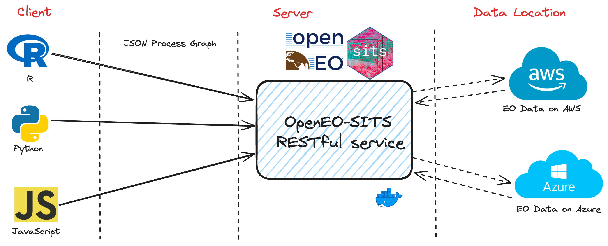

# openeosits: OpenEO Compliant R Backend Platform for Processing Time Series Satellite Images

The service wraps SITS R package to be a lightweight platform to enable analysis of time series satellite images via OpenEO Compliant RESTful endpoints. 

####  The Concept:



## Easy Deployment with Docker
If you want to change the source code then this approach is recommended.
You first need to clone the repository via this command:

```bash
git clone http://gitlab.opengeohub.org/bpondi/openearthmonitor.git
```

then you can change to that directory

```bash
cd openearthmonitor
```

Run it :

```bash
docker-compose up
```

Run in detached mode :

```bash
docker-compose up -d
```

Shutting it down:

```bash
docker-compose down
```

Force restart  and rebuild:

```bash
docker-compose up --build --force-recreate --no-deps -d
```

If there are new changes on the images or Dockerfiles:
```bash
docker-compose build --no-cache && docker-compose up
```
